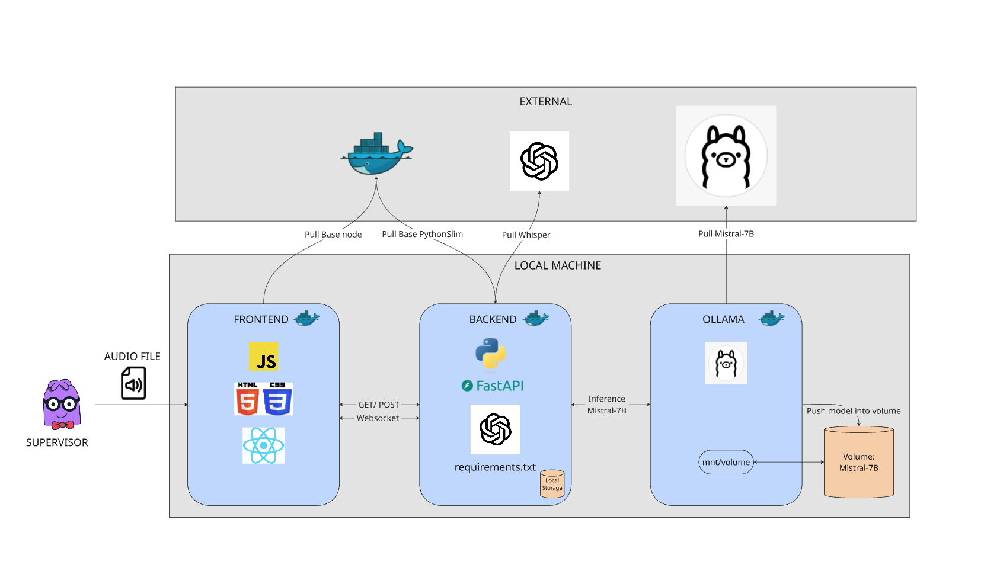

# 🎧 Agent Reviewer

Agent Reviewer is a powerful application designed to evaluate call center personnel by analyzing audio recordings. It provides in-depth assessments using a combination of built-in and user customizable metrics, delivering actionable business insights from every conversation.

## 🚀 Features

- Audio Processing: Upload audio files directly, no pre-processing or conversion required.
- Format Support: Compatible with all common audio formats (mp3, wav, etc.).
- Automated Evaluation: Assess agent performance with powerful LLM analytics.
- Custom Metrics: Supply additional evaluation criteria to fit your business case.
- Business Insights: Extract trends, sentiment, and customer satisfaction indicators.

## 💼 Use Cases

- Quality assurance for customer service teams
- Agent performance benchmarking
- Identification of training opportunities
- Measuring customer sentiment and engagement

## 🛠️ How It Works

1. <b>Upload</b> a call recording through the app interface.
2. <b>Process</b> the audio using built-in or user-supplied metrics.
3. <b>Review</b> an automatically generated evaluation report.
4. <b>Analyze</b> employee trends and insights across multiple recordings.

## 📦 Quick Start

1. <b>API Key</b><br>
Agree to the Pyannote.audio terms and generate Hugging Face API key https://github.com/pyannote/pyannote-audio?tab=readme-ov-file#tldr

2. <b>Clone</b><br>
```git clone https://github.com/nthanapaisal/agent-reviewer```

3. <b>Env</b><br>
```cd agent-reviewer/backend/src/```<br>
create file ```.env```<br>
add API key to .env file ```HUGGING_FACE="your_api_key_here"```

4. <b>Compose</b><br>
```cd agent-reviewer```<br>
```docker compose up --build -d```

Further documentation  located in [BUILD.md](./BUILD.md)

## 📝 Diagram



## ⚙️ Pipeline (simplified)

1. Speaker Diarization: pyannote.audio
2. Audio Transcription: openai-whisper
3. Prompt Construction: Spacy
4. Analysis: Mistral-7B
5. Trend Generation: Numpy

## 📚 Examples

<p align="center">
  
&nbsp; &nbsp; &nbsp; &nbsp;
  
</p>

## 📈 Metrics

Relevance: Evaluates whether the agent's response addresses the user's question<br>
Clarity: Evaluates the clarity of the agent's response<br>
Sentiment Score: Analyzes the sentiment polarity of the agent's tone (positive, neutral, negative)<br>
Completeness: Evaluates whether the agent's response contains complete information<br>
Consistency: Evaluates whether the agent's response is consistent with the context<br>
User Satisfaction: Measures the user's satisfaction with the agent's response<br>
Engagement Level: Evaluates the depth of the user's interaction (e.g., simple response vs. asking more questions)<br>
Problem Solved: Indicates whether the agent successfully solved the user's problem<br>
Context Awareness: Evaluates whether the agent correctly understands the conversation context

## 💬 Default Prompt

You are an agent evaluator. Evaluate the agent in this conversation: \"{transcription}\" using these metrics: \"{metrics}\", also focus and show first on \"{user_prompt}\" giving a score on a scale out of 5. Be flexible and reasonable in your evaluation—do not apply overly strict standards. Consider the agent’s intent, overall helpfulness, and adaptability when scoring. At the end provide a 2–3 sentence paragraph summarizing the agent's performance. Note that the transcript speaker labels may be inaccurate; you may reassess them when evaluating.\nReturn your response strictly as a valid JSON object using double quotes for all keys and strings, like this:\n{{\n  \"report\": [[\"metric_name\", score, \"reason\"], ...],\n  \"summary\": \"Your 2–3 sentence summary here.\"\n}}
