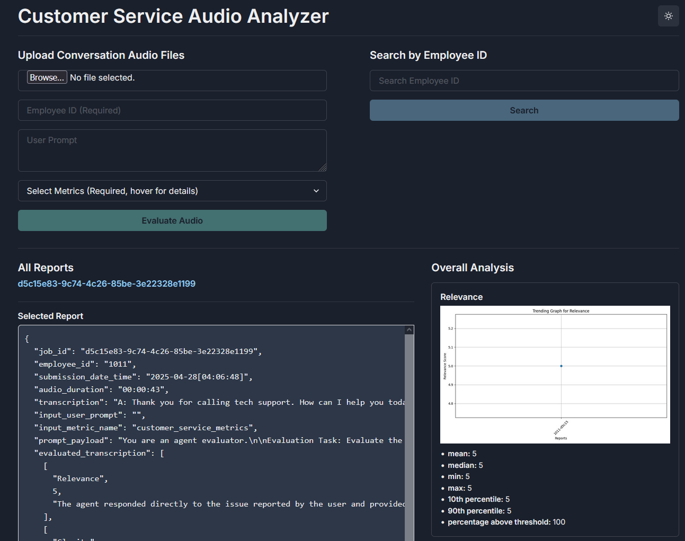
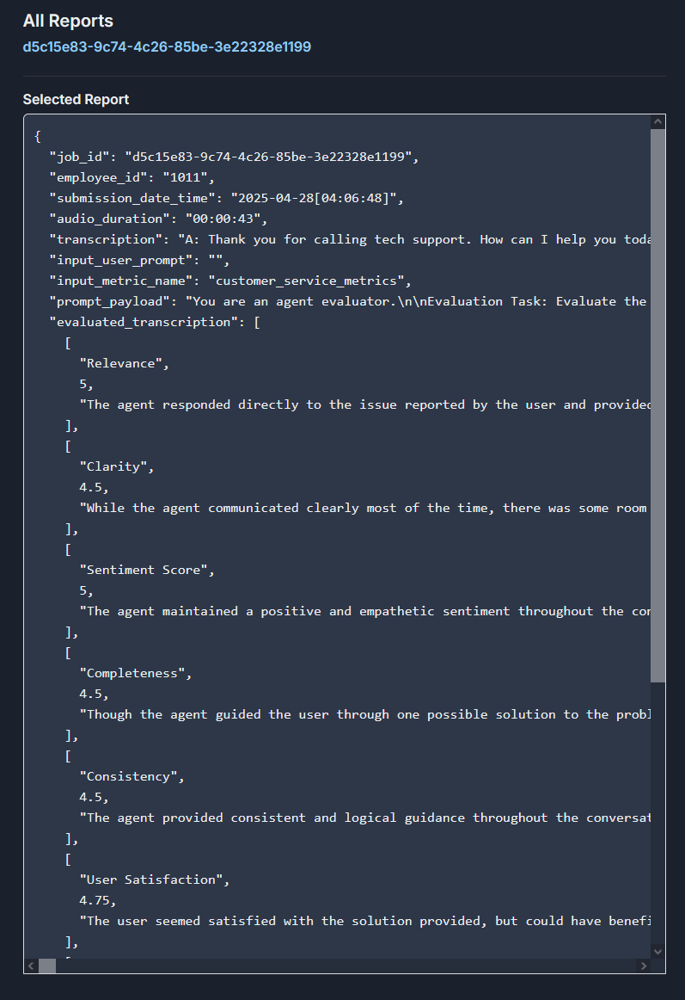
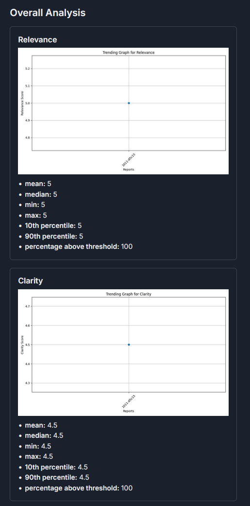

# 🎧 Agent Reviewer

Agent Reviewer is a powerful application designed to evaluate call center personnel by analyzing audio recordings. It provides in-depth assessments using a combination of built-in and user customizable metrics, delivering actionable business insights from every conversation.

## 🚀 Features

- Audio Processing: Upload audio files directly, no pre-processing or conversion required.
- Format Support: Compatible with all common audio formats (mp3, wav, etc.).
- Automated Evaluation: Assess agent performance with powerful LLM analytics.
- Custom Metrics: Supply additional evaluation criteria to fit your business case.
- Business Insights: Extract trends, sentiment, and customer satisfaction indicators.

## 💼 Use Cases

- Quality assurance for customer service teams
- Agent performance benchmarking
- Identification of training opportunities
- Measuring customer sentiment and engagement

## 🛠️ How It Works

1. <b>Upload</b> a call recording through the app interface.
2. <b>Process</b> the audio using built-in or user-supplied metrics.
3. <b>Review</b> an automatically generated evaluation report.
4. <b>Analyze</b> employee trends and insights across multiple recordings.

## 📊 Presentation, Demo, and Report

[Presentation](https://www.youtube.com/watch?v=6meUpAdhCMM)<br>
[Demo](https://www.youtube.com/watch?v=VtGpv9y1cGk)<br>
[Report](https://docs.google.com/document/d/15oGavOF3YFqVtBIc-VrH7A3wUE2p8VxLUmTzzLkb1Xg/edit?usp=sharing)

## 📦 Quick Start

1. <b>API Key</b><br>
Agree to the Pyannote.audio terms and generate Hugging Face API key https://github.com/pyannote/pyannote-audio?tab=readme-ov-file#tldr

2. <b>Clone</b><br>
```git clone https://github.com/nthanapaisal/agent-reviewer```

3. <b>Env</b><br>
```cd agent-reviewer/backend/src/```<br>
create file ```.env```<br>
add API key to .env file ```HUGGING_FACE="your_api_key_here"```

4. <b>Compose</b><br>
```cd agent-reviewer```<br>
```docker compose up --build -d```

Further documentation  located in [BUILD.md](./BUILD.md)

## 📝 Diagram


## ⚙️ Pipeline (simplified)

1. Speaker Diarization: pyannote.audio
2. Audio Transcription: openai-whisper
3. Prompt Construction: Spacy
4. Analysis: Mistral-7B
5. Trend Generation: Numpy

## 📈 Metrics

Relevance: Evaluates whether the agent's response addresses the user's question<br>
Clarity: Evaluates the clarity of the agent's response<br>
Sentiment Score: Analyzes the sentiment polarity of the agent's tone (positive, neutral, negative)<br>
Completeness: Evaluates whether the agent's response contains complete information<br>
Consistency: Evaluates whether the agent's response is consistent with the context<br>
User Satisfaction: Measures the user's satisfaction with the agent's response<br>
Engagement Level: Evaluates the depth of the user's interaction (e.g., simple response vs. asking more questions)<br>
Problem Solved: Indicates whether the agent successfully solved the user's problem<br>
Context Awareness: Evaluates whether the agent correctly understands the conversation context

## 💬 Default Prompt

You are an agent evaluator.

Evaluation Task: Evaluate the agent in this conversation: \"{transcription}\" using these metrics: \"{metrics}\". Additional user metrics: \"{user_prompt}\".

Evaluation Behavior Instruction:  Be flexible and reasonable in your evaluation—do not apply overly strict standards. Consider the agent’s intent, overall helpfulness, and adaptability when scoring. Take into consideration that some callers may be irrational and unfair; sometimes, it is out of the agent’s control.  Note that the transcription speaker labels may be inaccurate; you may reassess them when evaluating.

Scoring and Expected Output: There are two requirements: 1. For each metric_name: give a score on a scale out of 5 along with the reason. 2. Write a 9–15 sentence paragraph summarizing the agent's overall performance. Include specific quotes from the transcription that significantly influenced your evaluation, and explain why they were important. If the agent performed well, offer praise to encourage a positive learning environment. If the agent did not perform well, suggest what they could have done better.

Formatting Instruction:<br>
Return your response strictly as a valid JSON object using double quotes for all keys and strings, like this:<br>
{{"report\": [[\"metric_name\", score, \"reason\"]], \"summary\": \"Your summary here. don't forget quotes from transcription\"}}

## 📚 Example

<br>

#### Pipeline Results

<br>


